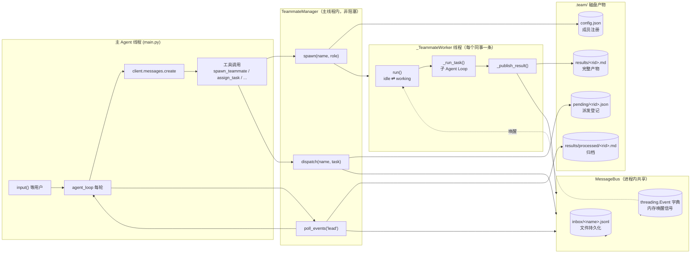
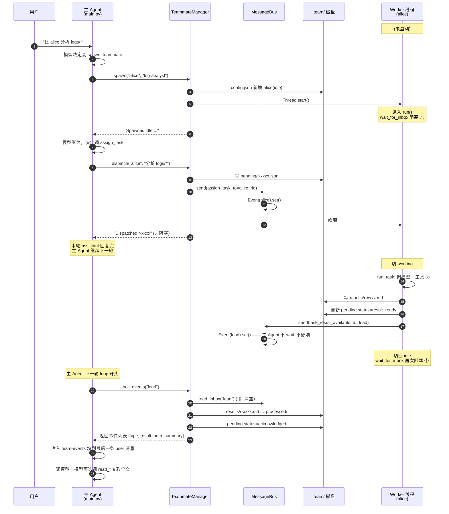
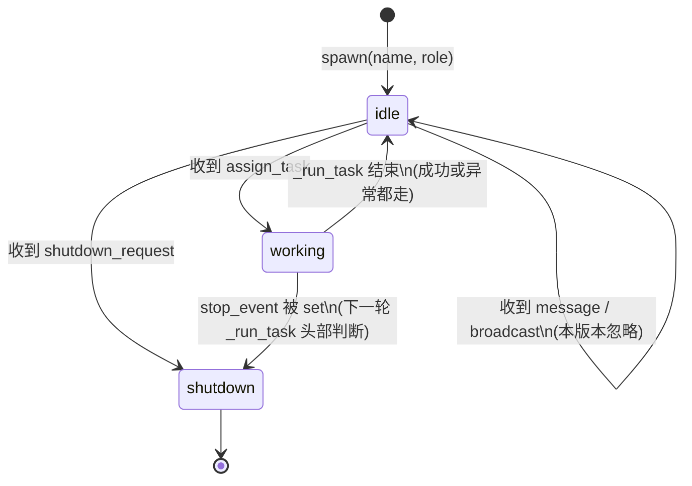
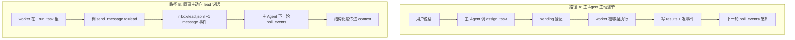

# 多 Agent 协作数据流

> 读完本文你应该能答上来：
> 1. 主 Agent 和同事 Agent 分别跑在哪条线程上？谁在哪里阻塞？
> 2. 一个任务从派单到结果入 context，经过哪几张表 / 哪几个文件？
> 3. 同事 Agent 干完活后，主 Agent 是怎么「知道」的？

文件实现：`modules/teammate.py`、`main.py`、`tools/__init__.py`。

---

## 1. 全景：组件与数据容器



**关键点：**

- **双通道**：主 Agent 和同事 Agent 之间有两条通道——
  - **控制面**（`MessageBus` 的 jsonl + Event）：短消息，触发动作
  - **数据面**（`.team/results/*.md`）：完整产物，避免把大段文本塞进 context
- **唯一的共享内存**：`TeammateManager.threads` 和 `MessageBus._events`；其它全靠文件，进程被 kill 也不丢。
- **非阻塞边界**：主 Agent 只在 `input()` 和 `client.messages.create()` 阻塞。`TeammateManager.*` 全部立即返回。

---

## 2. 时序：一次完整派单 → 回收



**两个阻塞点**（图中 ① ②）：

| 记号 | 位置 | 谁阻塞 | 何时醒 |
| --- | --- | --- | --- |
| ① | `_TeammateWorker.run` 的 `wait_for_inbox` | worker 线程 | `MessageBus.send` 触发 `Event.set` / 超时 |
| ② | `_run_task` 里的 `client.messages.create` | worker 线程 | 网络回包 |

主 Agent 全程不阻塞在这套机制上 —— 它自己的阻塞在 `input()` 和它自己调模型那里。

---

## 3. Worker 的状态机



- `idle → working` 是唯一进入「真正做事」的路径；必须是 `assign_task` 触发，不会自己启动。
- `working → idle` 一定伴随一次 `_publish_result`（即便 `_run_task` 抛异常也会把错误文本当结果落盘），保证 lead 永远收到一条事件，不会出现"派了活但不回音"的状态。
- `shutdown` 是单向吸收态：线程函数 `run()` 返回，daemon 线程自然终结。

---

## 4. 数据流：每一步哪些文件 / 对象发生了什么

以 `alice` 接一个 `rid=r-abcd` 的任务为例：

| 步骤 | `config.json` | `inbox/alice.jsonl` | `inbox/lead.jsonl` | `pending/r-abcd.json` | `results/r-abcd.md` | `processed/r-abcd.md` |
|---|---|---|---|---|---|---|
| 0. 初始 | — | — | — | — | — | — |
| 1. `spawn` | 新增 alice(idle) | — | — | — | — | — |
| 2. `dispatch` | — | +1 `assign_task` | — | 新建 (dispatched) | — | — |
| 3. worker 唤醒 | alice→working | 读空 | — | — | — | — |
| 4. `_run_task` 中 | — | (可能收到 lead 追发的澄清) | — | — | — | — |
| 5. `_publish_result` | alice→idle | — | +1 `task_result_available` | status→result_ready | 写入完整内容 | — |
| 6. `poll_events` | — | — | 读空 | status→acknowledged | **被移走** | **归档至此** |
| 7. 主 Agent 读全文（可选） | — | — | — | — | — | `read_file` 读取 |

几个容易误会的点：

- **事件里不带结果正文**：步骤 5 里 `task_result_available` 消息只带 `request_id + result_path + summary` 三项小字段。正文仍在 `results/r-abcd.md` 里。这是为了避免一发完整结果就被塞进主 Agent 的 context，尤其是 10k tokens 的长分析报告。
- **归档不是删除**：步骤 6 把 `results/*` 挪到 `results/processed/*`，保留在磁盘上。主 Agent 后续想回顾可以直接 `read_file`。
- **pending 是唯一状态源**：任务的四种状态（`dispatched → result_ready → acknowledged`，或异常时保持 `dispatched`）都写在 `pending/*.json` 里，`/inbox` 命令直接读它就能给出运行态全貌。
- **inbox 是「吃掉就没了」**：`read_inbox` 读完即清空。所以主 Agent 的 `/inbox` 命令故意改成读 `pending` 而不是读 inbox——否则会把事件吞掉，导致 `poll_events` 在下一轮拿不到事件。

---

## 5. 两种触发路径对比：主动派单 vs 被动推送



两条路共用同一个 `MessageBus` 和 `poll_events`；区别在于 `poll_events` 里区分 `task_result_available` 要不要做归档/状态推进而已。

---

## 6. 线程/锁总结

| 对象 | 创建者 | 线程归属 | 保护方式 |
|---|---|---|---|
| `TeammateManager.threads / stop_events` | 主 Agent 线程 | 只读写于主线程 | 无需锁 |
| `MessageBus._events` 字典 | 懒创建 | 任一线程都可能访问 | `_events_lock` |
| 每个 name 对应的 `threading.Event` | 懒创建 | 双边访问（set/wait） | `Event` 本身线程安全 |
| `inbox/<name>.jsonl` | worker 或 main 追加；对端读空 | 跨线程 | 单消费者假设 + append 写 |
| `config.json` | worker 改自己 status / manager 增成员 | 跨线程 | 模块级 `_config_lock` |
| `pending/<rid>.json` | manager 写；worker 改；manager 再改 | 跨线程但时间上不重叠 | 靠时序互斥，不加锁 |
| `results/<rid>.md` | 只有对应 worker 写；只有 manager 挪走 | 跨线程但时间上不重叠 | 靠时序互斥，不加锁 |

> 本项目走的是"时序互斥 + 单消费者"这条简化路线：一个文件在同一时间只会被一个角色碰。真要做到生产级（比如多主 Agent、worker crash 重试），就需要文件锁 + WAL + 去重这一套了。

---

## 7. 一个最小的交互示例

```
user> 你去 spawn 一个叫 alice 的日志分析师，让他把 logs/ 下 ERROR 统计成表
assistant (turn 1): 好的，我来安排。
    [tool] spawn_teammate(name="alice", role="log-analyst")
      → "Spawned idle teammate 'alice' (role: log-analyst)"
    [tool] assign_task(name="alice",
                       task="统计 logs/ 下所有 ERROR 行，按模块聚合，输出 markdown 表")
      → "Dispatched task r-f8a2b1c3 -> alice"
    回复用户: 已派 r-f8a2b1c3 给 alice，稍候为您同步结果。

(alice 线程后台开工 …… 2 分钟后)
[teammate:alice] finished task r-f8a2b1c3

user> 她完成没？
[main] 每轮 loop 开头 poll_events("lead"):
    - [result] request_id=r-f8a2b1c3 from=alice
      path=.team/results/processed/r-f8a2b1c3.md
      summary: 共 312 条 ERROR，集中在 auth / db / sync 三个模块...

assistant (turn 2):
    [tool] read_file(path=".team/results/processed/r-f8a2b1c3.md")
    回复用户: alice 刚交货了。下面是整理好的统计表 ...
```

这整条链路里没有忙轮询、没有同步等待、没有大段文本占 context —— 就是用 **指针 + 事件** 把 "分派" 和 "回收" 解耦成两次完全不同的 loop turn。
