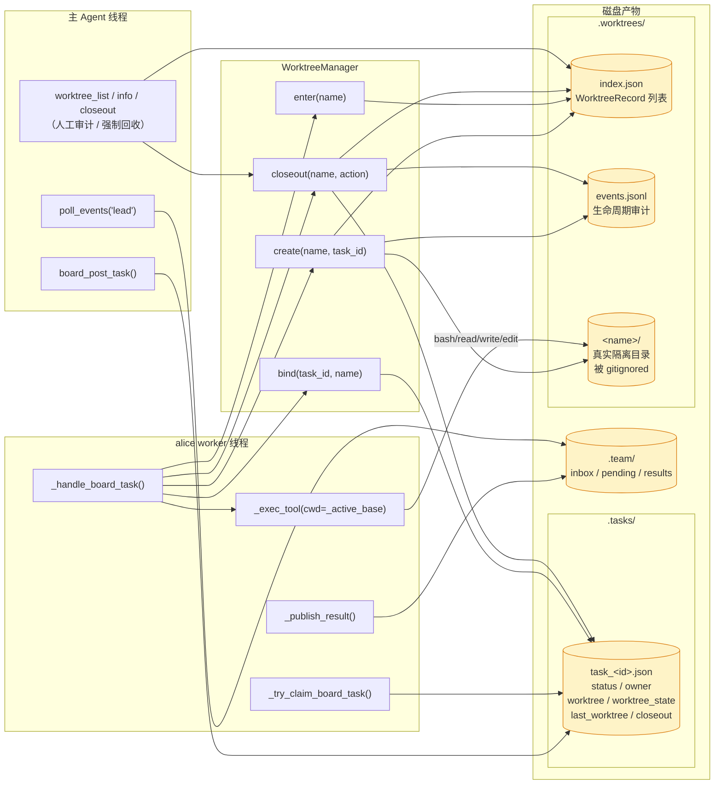
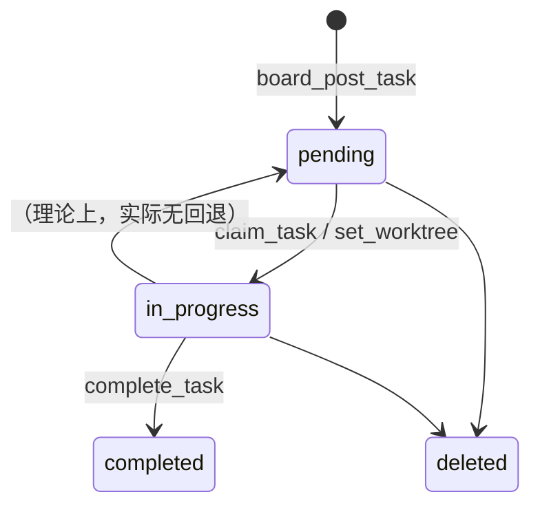
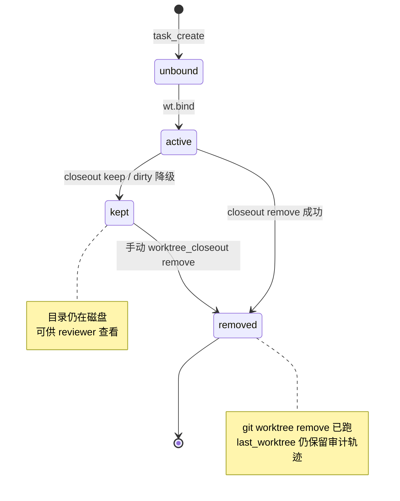
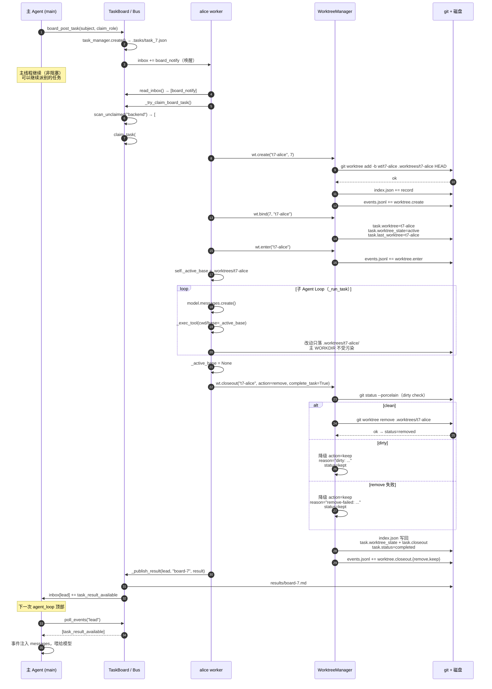
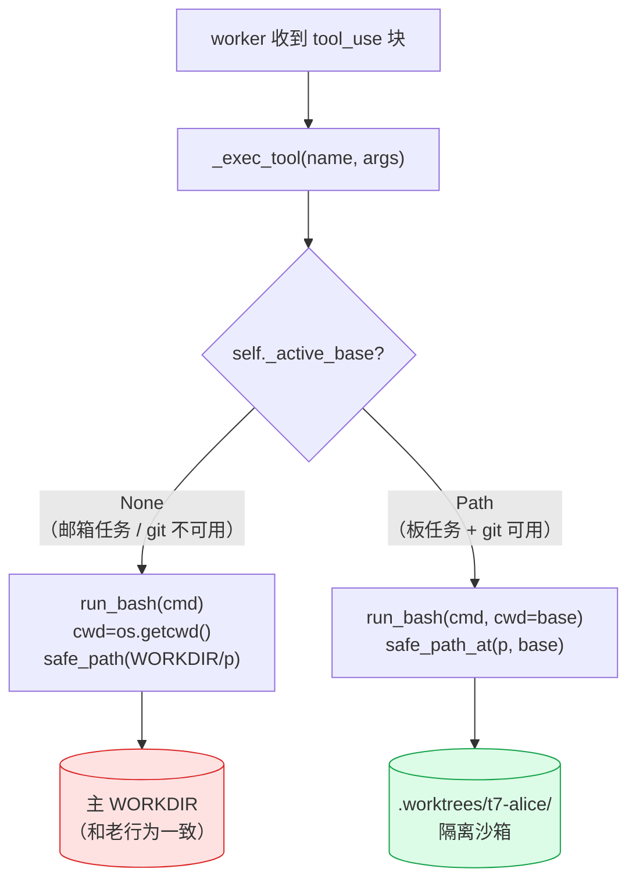
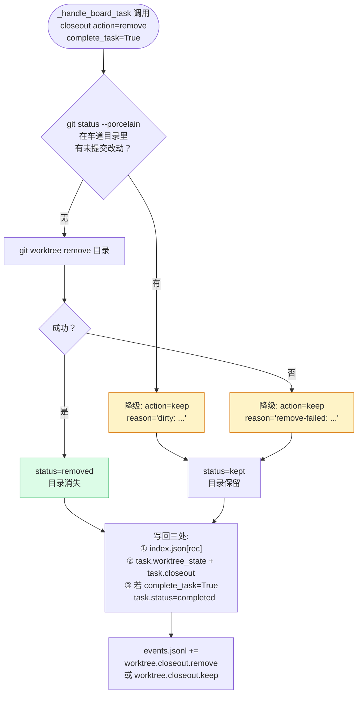
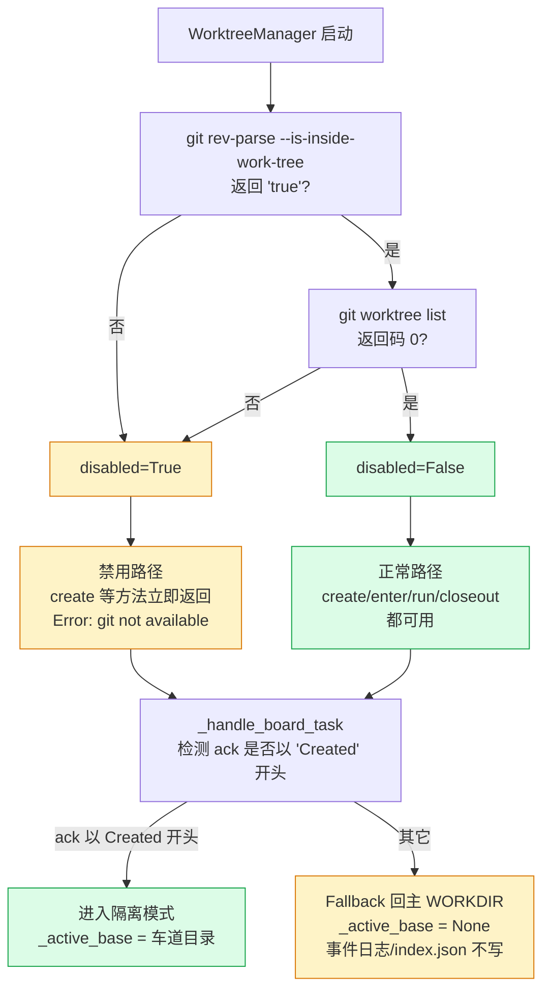
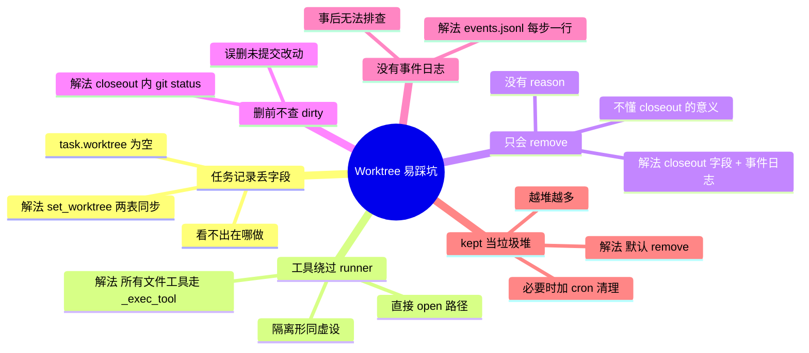
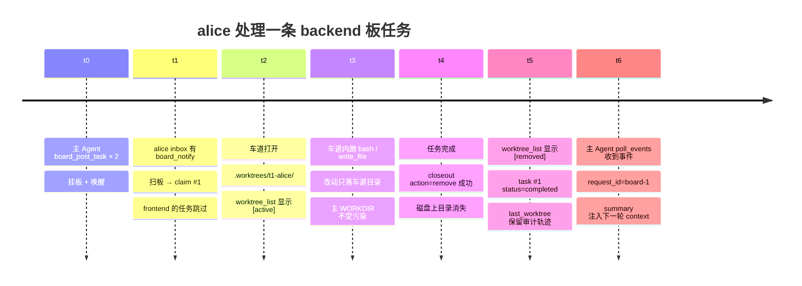
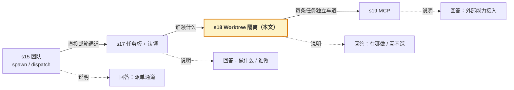

# Worktree 隔离机制

> 读完本文你应该能答上来：
> 1. 为什么任务板解决不了并行改同一个文件的问题？
> 2. 一条板任务从认领到结束，经过哪些文件 / 目录 / 状态字段？
> 3. worker 什么时候"进"车道、什么时候"出"车道？收尾时"保留"和"删除"怎么选？
> 4. git 不支持 `worktree` 时会怎么样？

相关代码：`modules/worktree.py` · `modules/teammate.py::_handle_board_task` · `modules/taskBoard.py` · `modules/task.py` · `tools/common.py`

---

## 1. 为什么要隔离

已经落地的 [任务板 + 认领机制](./multiagent-dataflow.md) 让多个同事 Agent 并行干活，但**所有 worker 共享同一个工作目录**。很快会出现三件事：

- 两个任务同时改同一个文件，互相覆盖
- A 任务做到一半，B 任务的改动已经把目录污染了
- 事后想单独回看 `#7` 任务改了什么，无法区分

任务板回答的是"做什么"，没有回答"**在哪做**"。worktree 隔离要做的就是后者：

> **每条被认领的板任务，自动在 `.worktrees/<name>/` 开一条独立的 git worktree，worker 所有文件操作都限制在这个目录里。**

---

## 2. 全景：两张表 + 一份事件日志 + 隔离目录



**两张表通过 `task_id` 一对一串联：**

```jsonc
// .tasks/task_7.json
{
  "id": 7,
  "subject": "refactor cron.py",
  "status": "in_progress",
  "owner": "alice",
  "worktree": "t7-alice",
  "worktree_state": "active",
  "last_worktree": "t7-alice",
  "closeout": null
}

// .worktrees/index.json
{
  "worktrees": [
    {
      "name": "t7-alice",
      "path": ".worktrees/t7-alice",
      "branch": "wt/t7-alice",
      "task_id": 7,
      "status": "active",
      "last_entered_at": 1776000000.0,
      "last_command_at": null,
      "last_command_preview": null,
      "closeout": null
    }
  ]
}
```

### 为什么 `status` 和 `worktree_state` 必须分开

不是同一层东西：

| 字段 | 取值 | 回答的问题 |
|---|---|---|
| `task.status` | pending / in_progress / completed / deleted | 这件工作做到哪一步 |
| `task.worktree_state` | unbound / active / kept / removed | 这条执行车道现在是不是还活着 |

现实中"任务已 completed、worktree 还保留给 reviewer 看"非常常见，一个字段表达不了。

### 两层状态机

`task.status`：



`task.worktree_state`：



### 为什么还需要 `events.jsonl`

worktree 生命周期跨很多步，**只看当前 status 排查不了为什么会变成 kept**。`events.jsonl` 每行一条记录，含 `event / ts / task_id / worktree / reason`，是这条审计链的完整留痕。

---

## 3. 完整时序：从挂板到结果回传

以"主 Agent 挂一条 backend 任务、alice 认领"为例。



**关键时刻：**

| 步骤 | 动作 | 为什么重要 |
|---|---|---|
| 7-10 | `wt.create + bind + enter` | 隔离的门槛。过了这一步 worker 的所有写入都出不了 `.worktrees/t7-alice/` |
| 12-14 | `_exec_tool(cwd/base=_active_base)` | 隔离真正落地的地方。子进程 cwd 和 `safe_path_at` 的 base 同时被设成车道目录 |
| 16-23 | `wt.closeout` | 对应 s18 原文强调的"显式 closeout 决策"。无论 clean / dirty / remove-failed，都会落 `closeout = {action, reason, at}` 和对应的 event |
| 24-26 | `_publish_result` | 和邮箱派发任务**共用同一条回传管道**。主 Agent `poll_events` 视角看不出任务来源，`request_id=board-*` 前缀是唯一标识 |

---

## 4. 隔离是怎么落到每一次 `bash` 上的

关键在 `_TeammateWorker._exec_tool` 这一层路由：

```python
base = self._active_base   # Path or None

if tool_name == "bash":
    return run_bash(args["command"], cwd=base)
if tool_name == "write_file":
    return run_write(args["path"], args["content"], base=base)
if tool_name == "edit_file":
    return run_edit(args["path"], args["old_text"], args["new_text"], base=base)
if tool_name == "read_file":
    return run_read(path=args["path"], base=base)
```



**两条不变量**：

- `_active_base=None` → 完全退化到老行为，直投邮箱任务、不走板任务的 worker 都不受影响
- `_active_base=Path` → `run_bash(cwd=...)` 让子进程 cwd 是车道目录；`safe_path_at(p, base)` 把相对路径相对 base 解析，同时保留 WORKDIR 沙箱（车道目录本身也在 WORKDIR 下，不会触发逸出检测）

这也是为什么 worker 里**所有**落地动作必须走这 4 个 runner —— 直接 `open()` 绕过就废了隔离。

---

## 5. closeout 的决策树



**三条路径共同的收尾写回：**

1. `index.json[rec].status` = `removed` / `kept`
2. `index.json[rec].closeout` = `{action, reason, at}`
3. `task.worktree_state` = `removed` / `kept`
4. `task.worktree` = `""`（remove 时清空，keep 时保留）
5. `task.last_worktree` = `<name>`（**两条路径都保留**，便于事后审计）
6. `task.closeout` = `{...}`（镜像一份到任务记录）
7. `complete_task=True` 时 `task.status = completed`
8. 追加一行事件 `worktree.closeout.remove` 或 `worktree.closeout.keep`

---

## 6. 降级策略：git 不可用时会怎样

`WorktreeManager.__init__` 启动时先跑一次 `_probe_git`：



两个检测都必须通过才算"能用"。光第一条不够：**CentOS 7 自带的 git 1.8.3.1 认得仓库但不认识 `worktree` 子命令**（该功能 git 2.5 / 2015 年才引入）。

`disabled=True` 的 worker 行为：`_handle_board_task` 检测到 `create` 返回 `Error:` 开头，打印 `worktree unavailable ...; fallback to main WORKDIR`，`_active_base` 保持 `None`，任务照常完成，**对外表现和没加 worktree 层时一模一样**。已在 CentOS 7 环境上验证过。

---

## 7. 主 Agent 可用的 worktree 工具

大部分时候不需要手动介入 —— worker 自动开、自动收。遇到特殊情况有三个工具：

| 工具 | 作用 |
|---|---|
| `worktree_list` | 列所有车道（含 removed 的历史）及 `task_id`、`branch`、`status` |
| `worktree_info(name)` | 看单条详情：`last_entered_at` / `last_command_preview` / `closeout` |
| `worktree_closeout(name, action, reason?, complete_task?)` | 人工收尾：想保留 review 就 `keep`，想强制回收就 `remove`。dirty 检测和降级逻辑对手动调用同样生效 |

---

## 8. 初学者最常踩的坑



---

## 9. 快速复现（git ≥ 2.5 环境）

```python
# 主 Agent 交互：
spawn_teammate(name="alice", role="backend")
board_post_task(subject="refactor cron.py", claim_role="backend")
board_post_task(subject="add hero section", claim_role="frontend")
# 等一会儿
worktree_list
list_pending_tasks
task_list
```

预期观察顺序：



如果任务在车道里没 commit 留了脏改动：
- 目录被保留（`status=kept`、`closeout.reason` 前缀 `dirty:`）
- 主 Agent 可以 `worktree_info(name="t1-alice")` 看 `last_command_preview` 帮助排查
- 想强制清理要先 commit/stash，再 `worktree_closeout(name="t1-alice", action="remove")`

---

## 10. 这层在整套 multi-agent 里处在哪



任务板解决了"活怎么分下去"，worktree 给这些并行活划了独立车道。有了这两层，一组 agent 并行改同一个仓库才成为可能。

---

## 附：关键字段速查

| 字段位置 | 字段名 | 含义 |
|---|---|---|
| `task_<id>.json` | `worktree` | 当前绑定的车道名；remove 后置空 |
| `task_<id>.json` | `worktree_state` | `unbound` / `active` / `kept` / `removed` |
| `task_<id>.json` | `last_worktree` | 最近一次用过的车道名；remove 后仍保留 |
| `task_<id>.json` | `closeout` | `{action, reason, at}`，镜像自 WorktreeRecord |
| `index.json[*]` | `name` | 车道短名，约定 `t<task_id>-<worker_name>` |
| `index.json[*]` | `path` | 相对 WORKDIR 的目录路径 |
| `index.json[*]` | `branch` | 对应 git 分支，约定 `wt/<name>` |
| `index.json[*]` | `status` | `active` / `kept` / `removed` |
| `index.json[*]` | `last_entered_at` | worker 切入车道的时间戳 |
| `index.json[*]` | `last_command_at` | 车道里最近一次执行命令的时间戳 |
| `index.json[*]` | `last_command_preview` | 最近一条命令的前 120 字 |
| `events.jsonl` | `event` | `worktree.create` / `.enter` / `.run` / `.closeout.remove` / `.closeout.keep` / `.create_failed` |
